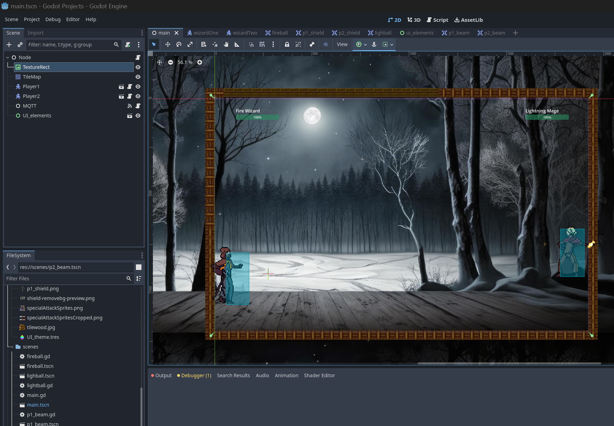
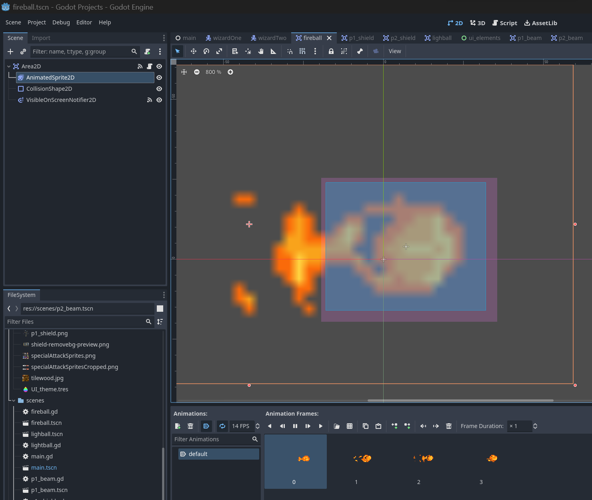
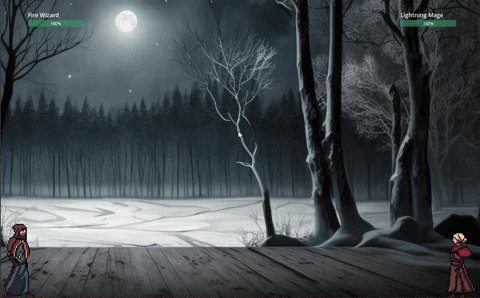
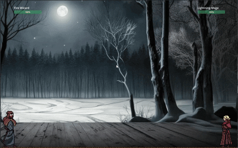
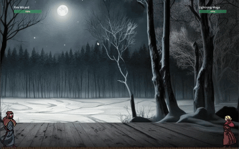

# Final Project: Strange Battle

## Project Overview
Strange battle is a 2D 1v1 game where players cast battle each other through spells to win. Each player has 4 different spells that they can cast. The spells are pulse, beam, defend and special attack. 
The spell selection interface was inpired from 'Dr. Strange', and we implemented the same through computer vision using OpenCV and mediapipe. The game is Godot, an open source game engine.

The hardware closely follows everything that the gameUI requires. The hardware for each player consists of a wand with a gyroscope and accelerometer and bracelet with a neopixel matrix that indicates the selected spell. The wand is used to cast the selected spell and colors change according to the spell that is selected. This can be better illustrated through a video.

## Table of Contents
- [Installation](#installation)
- [Design Implementation](#design-implementation)
- [Features](#features)
- [Contributors](#contributors)
- [License](#license)

## Installation
To replicate the project, you will need:
- 3 laptops
- 2 wands (build instructions in the implementation section)
- 2 bracelets (build instructions in the implementation section)
- Raspberry Pi (Only if you want to have your own MQTT broker)

## Design Implementation

### Spell Selection Interface and computer vision
"Yifan put your stuff here"

### The Game UI

The game was developed using Godot, an Open Source Game Engine. All the the game assets were downloaded from [deviant-art](https://www.deviantart.com/). 

The way godot works is that each interactable element is a 'scene'. Our game has the following scenes:
1. Main : The main node that conatins all other scenes
2. Fire Wizard : Player1, the character on the left hand side.
3. Lightning Mage: Player2, the character on the right hand side.
4. UI : The UI that health bars for both players
5. Player_1_spells: Shield, Pulse, Beam, Special Attack for Player1
6. Player_2_spells: Shield, Pulse, Beam, Special Attack for Player2

Below are a few snippets of the different spells we prototyped in Godot.
1. Beam Attack

2. Pulse Attack

3. Shield

4. Defending an attack

### The hardware
1. Wand:

2. Bracelet:

## Features
List the main features and functionalities of your game. Highlight any unique or standout elements.

## Contributors
- Siddharth Kothari (sk2793)
- Yifan Zhou (yz2889)
- Omar Mokhtar (om)

## License
Published under MIT license. Go ahead and build your own version of it!

